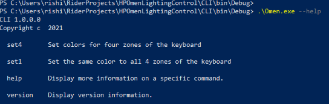
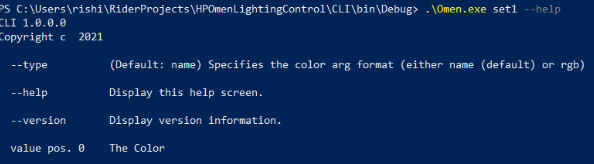
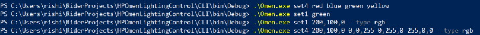

<!-- PROJECT LOGO -->
<br />
<p align="center">
  <a href="https://github.com/thebongy/omen-cli">
    
  </a>

  <b><h2 align="center">omen-cli</h2></b>

  <p align="center">
    A CLI to customize your keyboard backlight :rocket:
    <br />
    <a href="https://github.com/thebongy/omen-cli"><strong>Explore the docs »</strong></a>
    <br />
    <br />
    <a href="https://github.com/thebongy/omen-cli">View Demo</a>
    ·
    <a href="https://github.com/thebongy/omen-cli/issues">Report Bug</a>
    ·
    <a href="https://github.com/thebongy/omen-cli/issues">Request Feature</a>
  </p>
</p>


<!-- TABLE OF CONTENTS -->
## :dart: Table of Contents

* [About the Project](#about-the-project)
  * [Built With](#built-with)
* [Getting Started](#getting-started)
  * [Prerequisites](#prerequisites)
  * [Installation](#installation)
* [Usage](#usage)
* [Roadmap](#roadmap)
* [Contributing](#contributing)
* [License](#license)
* [Contributors](#contributors-)


<!-- ABOUT THE PROJECT -->
## :open_book: About The Project

`omen-cli` is  a lightweight CLI tools built in C# to customize keyboard backlights on HP Omen  laptops similar to how Omen Light studio does.


### Built With

* [C#](https://docs.microsoft.com/en-us/dotnet/csharp/)
* [.Net Framework 4.8](https://dotnet.microsoft.com/download/dotnet-framework/net48)
* [CommandLineParser](https://github.com/commandlineparser/commandline)


<!-- GETTING STARTED -->
## :airplane: Getting Started

To get a local copy up and running follow these simple steps.

### Prerequisites

* .NET Framework 4.8
* Nuget.exe CLI
* MSBuild.exe CLI

### Installation
 
1. Clone the repo
```sh
git clone https://github.com/thebongy/omen-cli.git
```

2. Install dependencies
```sh
nuget install .\CLI\packages.config -OutputDirectory packages
```

3. Run the following command from the root dir to build the project
```sh
MSBuild.exe
```


<!-- USAGE EXAMPLES -->
## :wrench: Usage
To view all the options available, use the `--help` command: 

 
 <br>

The `set4` command is used to set 4 colors to the 4 zones on the keyboard.

 

<br>

 The `set1` command is used to set the same color to all 4 zones.

 

<br>

`--type` can either be `rgb` or `name`, to give the colors in different formats. For example: 

 


<!-- ROADMAP -->
## :world_map: Roadmap

See the [open issues](https://github.com/thebongy/omen-cli/issues) for a list of proposed features (and known issues).


<!-- CONTRIBUTING -->
## :mechanical_arm: Contributing

Contributions are what make the open source community such an amazing place to be learn, inspire, and create. Any contributions you make are **greatly appreciated**.

1. Fork the Project
2. Create your Feature Branch (`git checkout -b feature/AmazingFeature`)
3. Commit your Changes (`git commit -m 'feat: Add some AmazingFeature'`)
4. Push to the Branch (`git push -u origin feature/AmazingFeature`)
5. Open a Pull Request

You are requested to follow the contribution guidelines specified in [CONTRIBUTING.md](./CONTRIBUTING.md) while contributing to the project :smile:.

<!-- LICENSE -->
## :page_facing_up: License

Distributed under the MIT License. See [`LICENSE`](./LICENSE) for more information.


